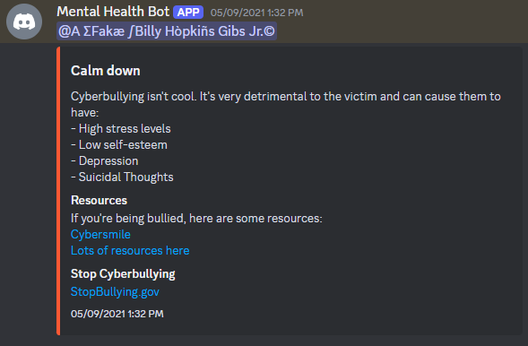
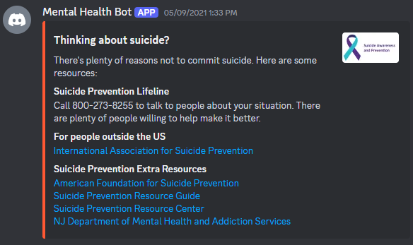

# Mentalth

A Mental Health Discord bot which is meant to help provide support to those having negative thoughts. This bot keeps track of depressional, suicidal, and cyberbullying messages from users or to users.

Originally created in May 2021 as my hackathon submission for Mercerhacks. Ended up winning 1st place in "Best Wellness/Health Hack" and 2nd place in "Most Creative".

## Structure

There are 2 different models and programming languages involved in this bot.

### Node JS version

This version is meant to provide the cyberbullying part of the bot by using the Tensorflow toxicity model to determine if a message is mean. One unique feature is that this bot also keeps track of the average toxicity in your server. So, if you have a group of friends who always make fun of each other, then this bot will only recognize those who are much more toxic than the other members of the server.

To determine the score, the algorithm I used was a variation of the "standard deviation" formula. I chose to use (x-mean)*abs(x-mean) as the variance function so that the sign of the score is preserved, while the magnitude is squared.

When the bot detects a user that's too mean, it sends a message telling them so, along with some additional resources for those who are victims of cyberbullying.

### Python Version

This version is meant to provide the depression/suicide analysis portion of the bot. This part is coded from scratch using keras and natural language processing. First, the data is fetched from Twitter using the "Twnit" API and is cleaned to remove any bad characters.
So far, this data is only depression thoughts, so that model isn't going to be very good at predicting the output. So, I used a Twitter Sentiment Analysis dataset from Kaggle to act as the "non-depressional" thoughts. And an equal amount of data items are fetched from both datasets and combined into the train data.

Then, a PorterStemmer is used to categorize the words into their roots and a Tokenizer is used to encode the data into numerical format. A word2vec model from Google is used to create an embedding matrix. The model is then created by using an Embedding Layer, Conv1d Layer, and a LSTM layer.

Since the dataset is already large, only 1 epoch was used with a batch size of 40. Then, the word2vec model and the Tokenizer are saved to file using "Pickle" to convert to raw binary bytes. The keras model is saved to a ".h5" file.

Finally, the pickle models and the keras model are imported in the "main.py" file, where the main discord bot runs.

### Both versions

For both versions, all the messages are fed into their respective model and predicted. If the prediction meets or exceeds their threshold, then the "score" of a user goes up. When this score is much bigger than the average for the server, then the bot sends a message with some resources for help.

Both versions are logged into the bot using the same token, so that both are running at the same time.

### Screenshots

